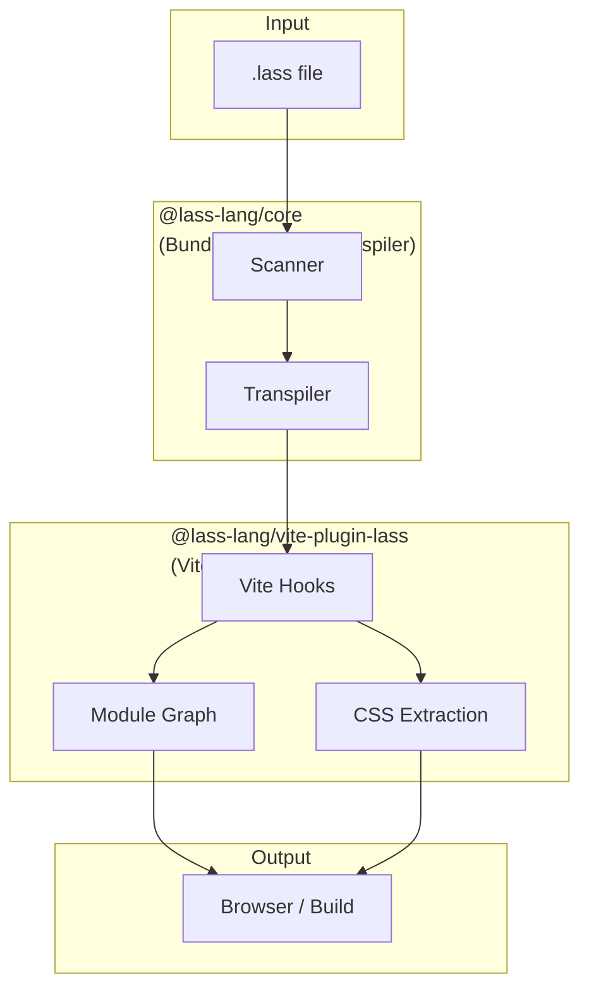
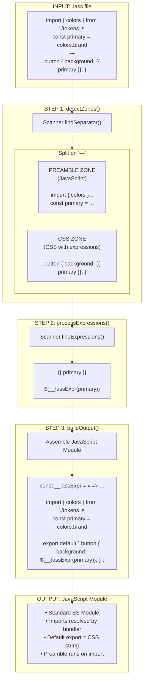
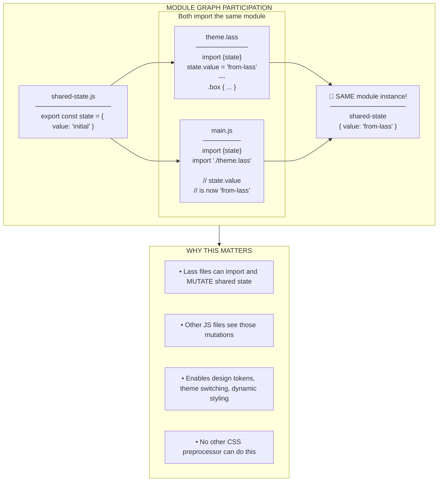
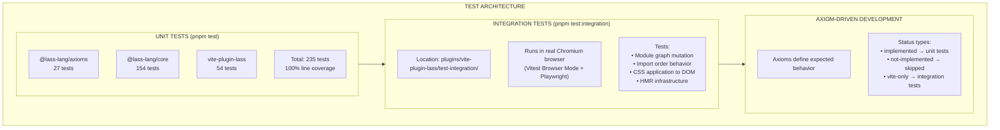
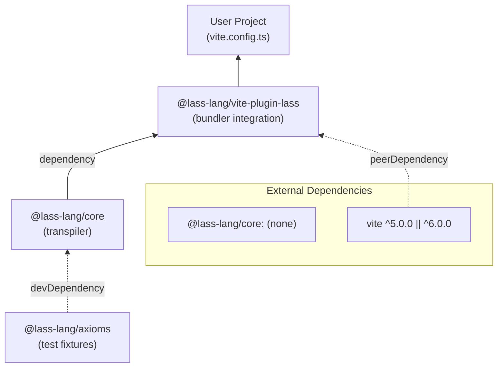
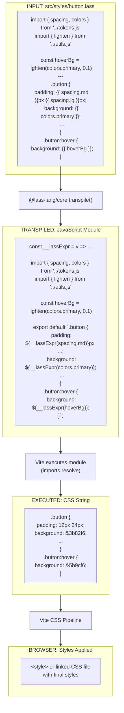

# Lass Architecture Diagram

> **Last Updated:** 2026-02-06 (Story P.1 Complete)
> 
> Update this document when major architectural changes occur.

## System Overview

## Package Architecture

```mermaid
flowchart TB
    subgraph Workspace["@lass-lang/dev-workspace"]
        subgraph Packages["packages/"]
            subgraph Core["@lass-lang/core"]
                CORE_INDEX["src/index.ts<br/>transpile() function"]
                CORE_SCANNER["src/scanner.ts<br/>Zone detection"]
                CORE_ERRORS["src/errors.ts<br/>Error types"]
            end

            subgraph Axioms["@lass-lang/axioms"]
                AXIOM_FILES["files/<br/>*.common.md"]
                AXIOM_LOADER["src/loader.ts"]
                AXIOM_TYPES["src/types.ts"]
            end
        end

        subgraph Plugins["plugins/"]
            subgraph VitePlugin["@lass-lang/vite-plugin-lass"]
                VP_INDEX["src/index.ts<br/>Plugin factory"]
                VP_RESOLVE["src/lib/1-resolve.ts"]
                VP_TRANSFORM["src/lib/2-transform.ts"]
                VP_LOAD["src/lib/3-load.ts"]
                VP_HMR["src/lib/4-hmr.ts"]
                VP_STATE["src/lib/state.ts"]
                VP_UTILS["src/lib/utils.ts"]
            end
        end
    end

    Core -.->|"devDependency"| Axioms
    VitePlugin -->|"dependency"| Core
```

## Transpilation Pipeline (@lass-lang/core)

## Vite Plugin Flow (@lass-lang/vite-plugin-lass)

```mermaid
flowchart TB
    subgraph Vite["VITE DEV SERVER / BUILD"]
        IMPORT["import './styles.lass'"]

        subgraph Resolve["1. RESOLVE (1-resolve.ts)"]
            R_DESC["• Handles .lass file resolution<br/>• Creates virtual modules"]
            R_FLOW["file.lass → resolved<br/>file.lass.css → virtual module"]
        end

        subgraph Transform["2. TRANSFORM (2-transform.ts)"]
            T_DESC["• Calls @lass-lang/core transpile()<br/>• Returns JS module with CSS import<br/>• Executes preamble code"]
            T_KEY["⭐ Output participates in MODULE GRAPH<br/>(Killer feature - mutations persist!)"]
        end

        subgraph Load["3. LOAD (3-load.ts)"]
            L_DESC["• Handles virtual .lass.css modules<br/>• Executes JS in isolation for CSS<br/>• Returns CSS to Vite pipeline"]
            L_FLOW["Virtual module → Pure CSS string"]
        end

        subgraph HMR["4. HMR (4-hmr.ts)"]
            H_DESC["• Tracks dependencies<br/>• Invalidates on changes<br/>• Enables live reload"]
        end

        IMPORT --> Resolve --> Transform --> Load --> HMR

        subgraph Output["Output"]
            JS_OUT["JS in Module Graph<br/>(imports, mutations)"]
            CSS_OUT["CSS in Vite Pipeline<br/>(bundling, minification)"]
        end

        HMR --> JS_OUT
        HMR --> CSS_OUT
    end
```

## The Killer Feature: Module Graph Integration

## Test Infrastructure

## Dependency Graph

## File Processing Example

---

## Version History

| Date       | Version | Changes                                    |
|------------|---------|-------------------------------------------|
| 2026-02-06 | 1.1     | Convert ASCII diagrams to Mermaid         |
| 2026-02-06 | 1.0     | Initial diagram (Story P.1 complete)      |
|            |         | - Core transpiler architecture            |
|            |         | - Vite plugin flow                        |
|            |         | - Integration test infrastructure         |
|            |         | - Module graph participation diagram      |

---

## Notes for Updating

When to update this document:
- New package added to workspace
- Major architectural change to transpiler or plugin
- New bundler integration added
- Test infrastructure changes
- New Vite hook added

Diagrams use Mermaid syntax for GitHub/GitLab rendering compatibility.
