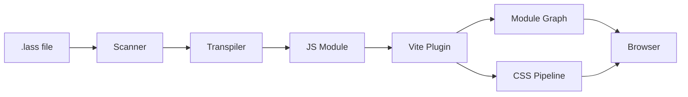
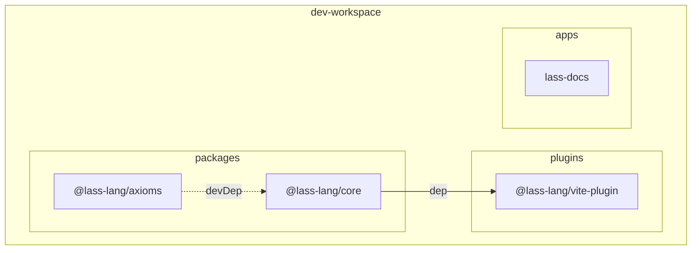
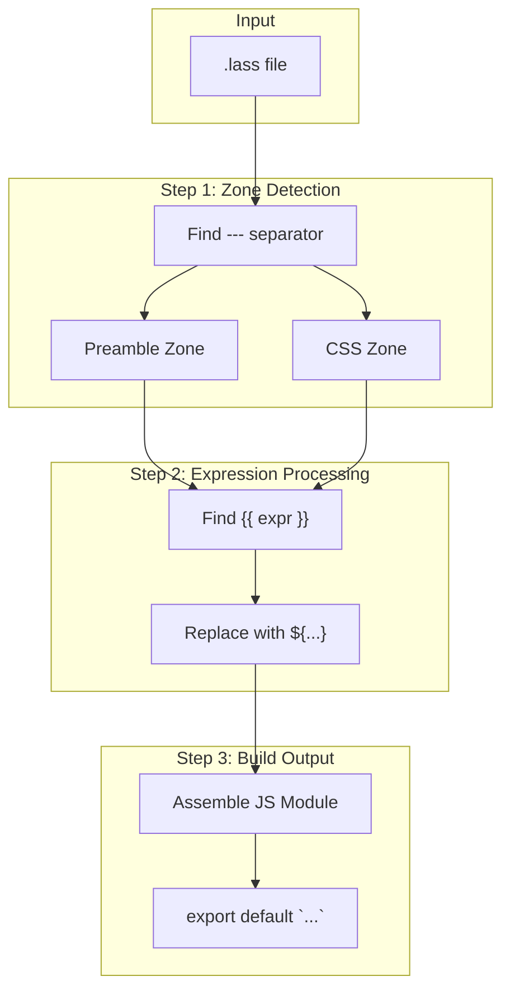
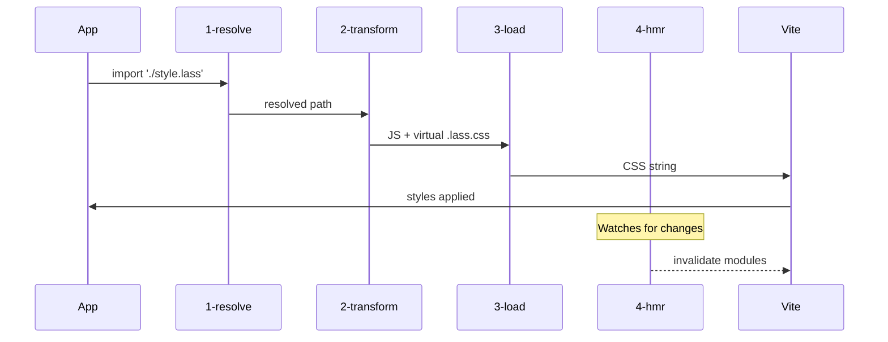
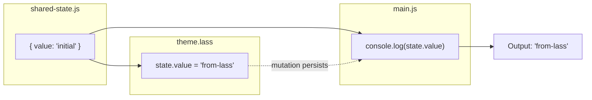
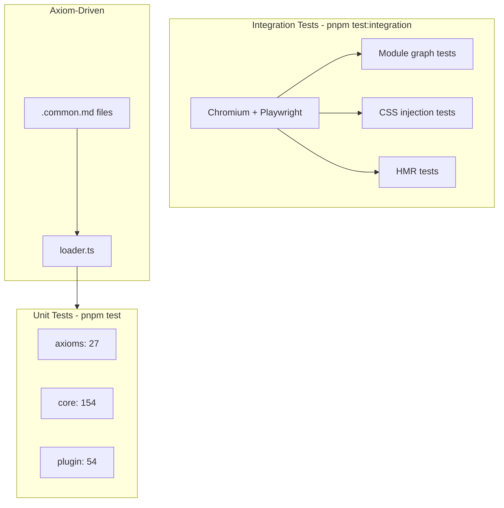
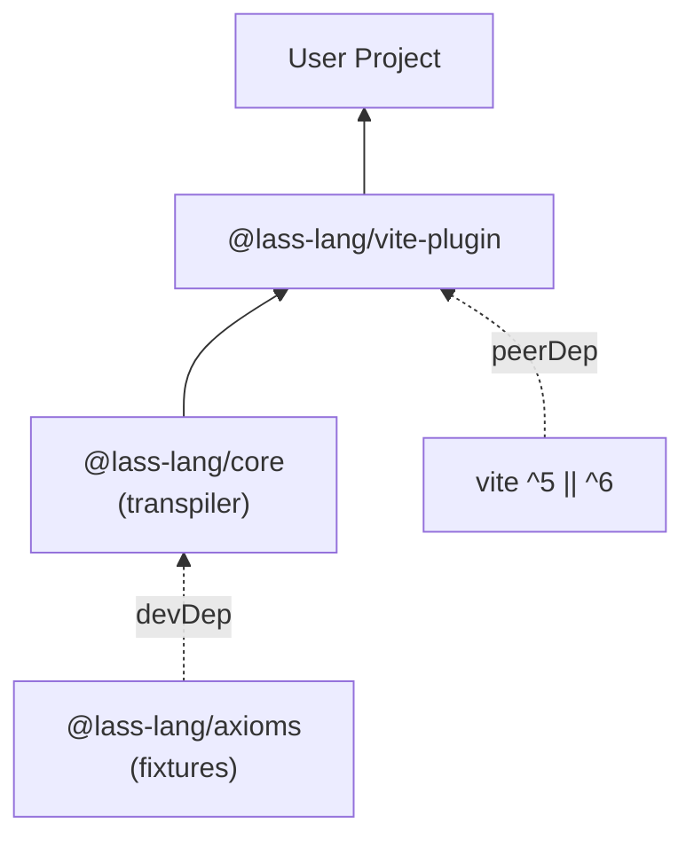
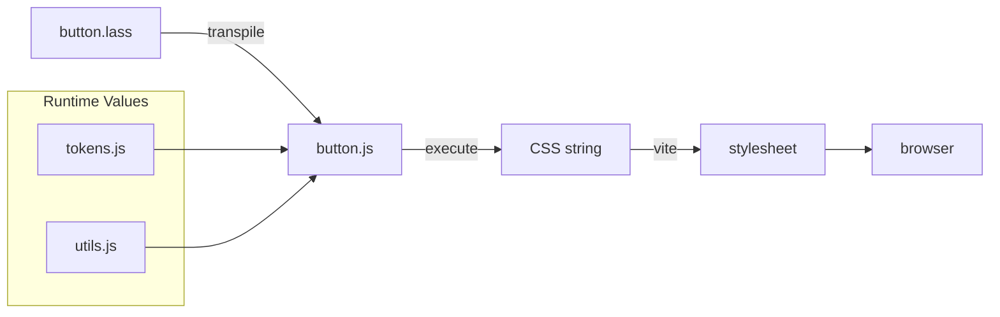

# Lass Architecture Diagram

> **Last Updated:** 2026-02-06 (Story P.1 Complete)

## System Overview

## Package Architecture

## Transpilation Pipeline

## Vite Plugin Hooks

## Module Graph Integration (Killer Feature)

This works because the transform hook puts preamble code in Vite's **real module graph**, not an isolated context.

## Test Infrastructure

## Dependency Graph

## File Processing Flow

---

## Version History

| Date | Changes |
|------|---------|
| 2026-02-06 | Convert to clean Mermaid diagrams |
| 2026-02-06 | Initial version (Story P.1) |
